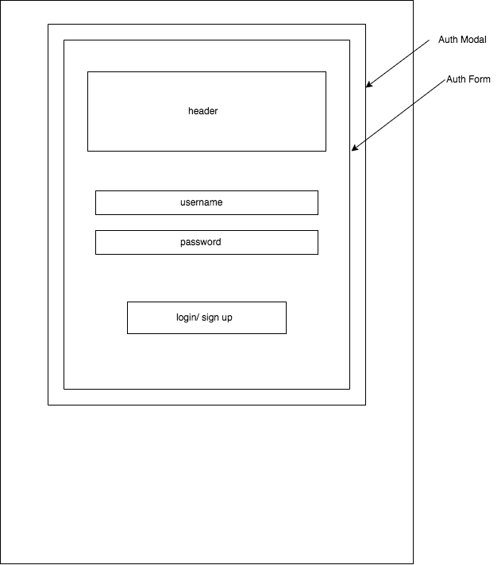
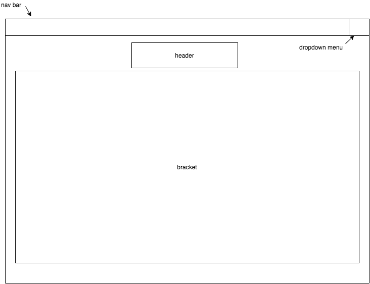
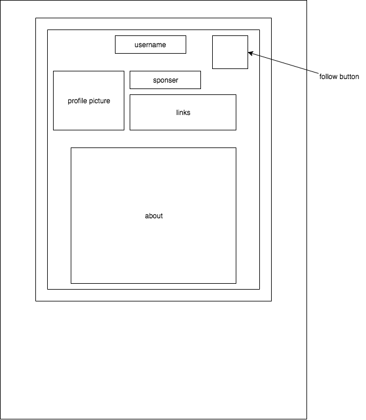
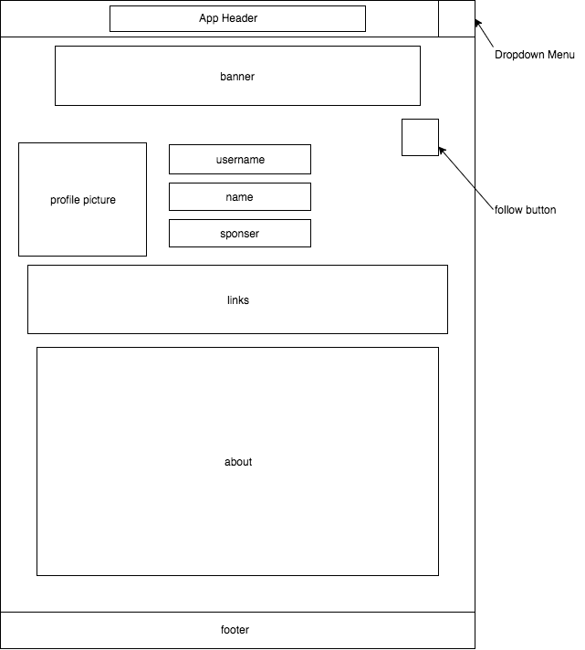

## BracketRunner (Flex project proposal)

### Background
People who run or participate in tournaments all know the pains of poorly written event reporting software. Not only is it prone to crashing and errors but its
often built on a 20 year old code base.  We are writing bracket runner to bring the tournament software into the modern age.
Additionally we found a disconnect between professional gammers and views.  It is difficult to know when and where your favorite player is playing on stream. BracketRunner will unify gamers and their views. Besides being able to load players and run a tournament, BracketRunner offers players the ability to create profiles and promote themselves as professional gamers connecting to their social media to their audience with real time tournament reporting.

### Functionality & MVP
- [ ] User Authentication Not Backend
- [ ] CRUD bracket functionality and bracket logic
- [ ] User Profiles
- [ ] Explore and Search

### Wireframes

#### Home

#### Home - Signed In

#### Auth Form Modal

#### Bracket

#### Dropdown Menu

#### User Profile Menu

#### User Profile Page

### Technologies & Technical Challenges
- We will be using the MERN stack. (MongoDB, Express, React-Native, NodeJS)

#### The primary technical challenges and pain points will be:
- Learning the MERN Stack -- none of us has have used this before, we will starting from a point of general knowledge setting up the proof of concept before utilizing a divide and conquer approach to the the front and backend.
- Authentication in React-Native
- Implementing a non-relational database

### Things we accomplished this weekend.
1. The group spent 6.5 hours on Saturday going though a MERN stack tutorial, as well as 4 hours crafting a the Project Proposal and making wireframes.
2. Sunday was spent building the proof of concept to be turned in Monday.

### Group Members & Work Breakdown
Our group consists of four members, Ali, Nick, Zach, and Zuhair.

Ali and Zuhair will be the back end developers. Their primary responsibilities will be:
- Models
- Controllers
- Routes
- API end points
- Mongo DB

Nick and Zach primary responsibilities will be:
- Components
- Reducer
- Util
- Actions
- Store

Our shared responsibilities include:
- Emulator
- Bracket Logic

### Implementation Timeline
**Day 1**:
- Catch up on tutorial and study the stack (Ali)
- Auth Forms (Nick)
- Bracket Forms(Zach)
- A general Schema and 1/2 of Auth(Zuhair)

**Day 2**:
- Bracket logic (Ali)
- Profile Page/Edit (Nick)
- Bracket Rendering 1/2 (Zach)
- 2/2 of Auth (Zuhair)
- User Model/Controller/Routes 1/2 (Zuhair)

**Day 3**:
- Bracket Model, Controller (Ali)
- User Profile  (Nick)
- Bracket Rendering 2/2  (Zach)
- User Model/Controller/Routes 2/2 (Zuhair)

**Day 4**:
- Front end, NavBar, Dropdown menu, Explore/Search Tool/display : TBD
- Back end, Search/Explore backend logic, Player Statistics, Emulator : TBD

**Day 5**:
- Create demo page for chrome extension. By the end of the day:
- Front end, NavBar, Dropdown menu, Explore/Search Tool/display : TBD
- Back end, Search/Explore backend logic, Player Statistics, Emulator : TBD

### Plan for getting users and reviews
Both Nick and Zach will send the app to Smash and Magic communities to solicit use
